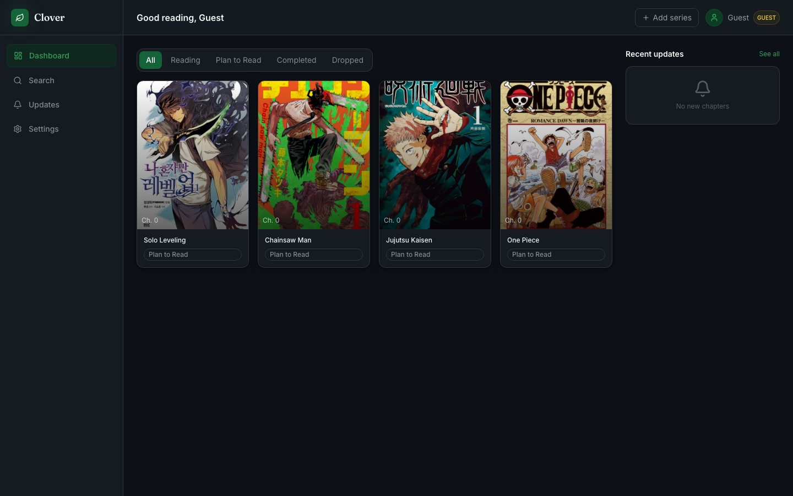
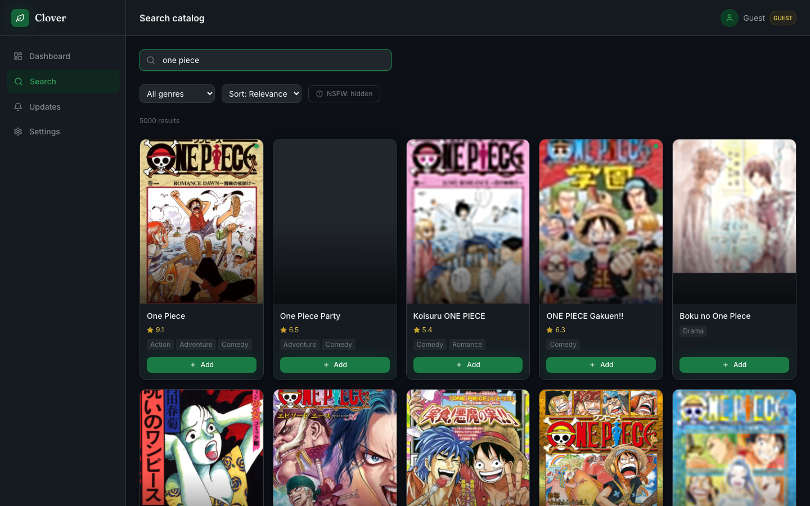
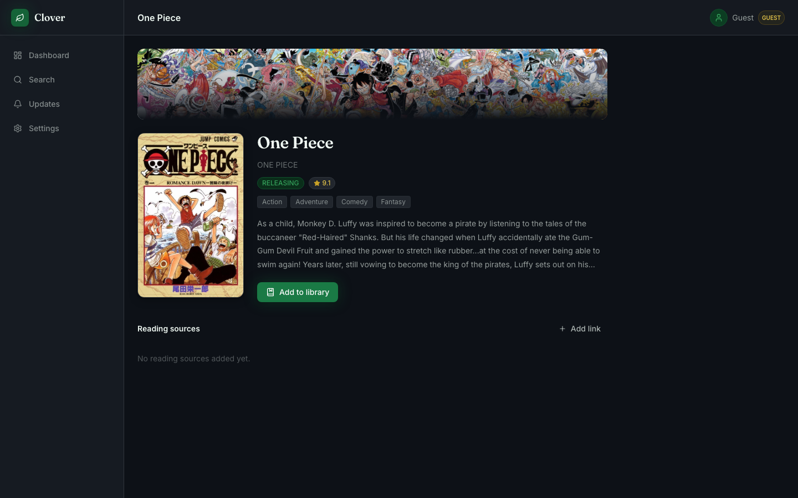

# Clover

A full-stack manga and manhwa tracking app. Search titles, build your personal library, track your current chapter, and get notified when new chapters drop on AsuraScans or MangaPlus.


---

## Screenshots

| Landing | Dashboard |
|---|---|
|  |  |

| Search | Series detail |
|---|---|
|  |  |

---

## Features

- **Guest access** — No signup required. Landing on any page of the app with no session transparently provisions an anonymous guest account (own JWT, own library) so you can start using Clover immediately; create a free account later if you want your library to follow you across devices
- **Catalog search** — Search thousands of manga/manhwa titles powered by the [AniList GraphQL API](https://anilist.gitbook.io/anilist-apiv2-docs/)
- **Search filters** — Filter results by genre, sort by relevance/popularity/rating/title, and an NSFW toggle (off by default) that excludes adult content, including anything genre-tagged Hentai
- **Ratings** — Each title shows its AniList community rating (0–10)
- **Personal library** — Track series with status (Reading, Completed, Dropped, Plan to Read) and current chapter (integer only)
- **Series detail pages** — Cover art, synopsis, genres, latest chapter, and reading source links
- **Reading sources** — Add your own bookmark links per series, or a provider-backed link (AsuraScans today, more providers can be added via a simple registry) that supports live chapter tracking
- **Tracked source per manhwa** — Pick which reading source is "the" one to track for each series in your library; it's pinged live for its latest chapter whenever you reload the series detail page (rate-limited to once per minute)
- **"Caught up" button** — Jump your current chapter straight to the tracked source's latest known chapter in one click
- **Smart "Open" link** — Opens the next chapter (current + 1) directly when the provider's URL scheme supports it, instead of just the series' landing page
- **Chapter updates feed** — Unread notifications when tracked series get new chapters
- **Background job** — Hourly scheduled job checks every provider-backed reading source for new chapters and fans out notifications to subscribers
- **Authentication** — Email/password and Google OAuth, with JWT access + refresh tokens

---

## Tech Stack

| Layer | Tech |
|---|---|
| Frontend | React 18, Vite, TypeScript, Tailwind CSS v3 |
| Backend | Next.js 14 (App Router — API routes only) |
| Database | PostgreSQL 16 |
| ORM | Prisma 5 |
| Auth | JWT (jose), bcryptjs, Google OAuth 2.0 |
| Scraping | Cheerio (AsuraScans), unofficial MangaPlus protobuf API (protobufjs) |
| Scheduler | node-cron via Next.js instrumentation hook |
| Dev | Docker Compose |

---

## Project Structure

```
clover/
├── clover-api/          # Next.js 14 backend (API routes only)
│   ├── app/api/         # Route handlers
│   ├── lib/             # Auth, DB client, AniList client, helpers
│   ├── providers/       # AsuraScans + MangaPlus scrapers
│   ├── jobs/            # Chapter update job
│   ├── prisma/          # Schema and migrations
│   └── instrumentation.ts  # Starts cron on server boot
│
├── clover-web/          # React + Vite frontend
│   ├── src/pages/       # Landing, Dashboard, Search, SeriesDetail, Updates, Settings
│   ├── src/components/  # UI, layout, series components
│   ├── src/api/         # Axios client + typed API modules
│   ├── src/store/       # Zustand auth store
│   └── nginx.conf       # Production nginx config
│
└── docker-compose.yml   # Postgres + API + Web
```

---

## Getting Started

### Prerequisites

- Node.js 20+
- Docker + Docker Compose (for the database)
- A Google Cloud project with OAuth 2.0 credentials (optional — only needed for Google login)

### 1. Clone and configure

```bash
git clone https://github.com/your-username/clover.git
cd clover

# Root env (Docker Compose)
cp .env.example .env

# Backend env (local dev)
cp clover-api/.env.example clover-api/.env
```

Fill in both `.env` files:

| Variable | Description |
|---|---|
| `JWT_SECRET` | Random string, minimum 32 characters |
| `GOOGLE_CLIENT_ID` | From Google Cloud Console (optional) |
| `GOOGLE_CLIENT_SECRET` | From Google Cloud Console (optional) |
| `DATABASE_URL` | PostgreSQL connection string |

### 2. Start the database

```bash
docker compose up postgres -d
```

### 3. Run the backend

```bash
cd clover-api
npm install
npm run db:migrate                    # Applies migrations, creates all tables
npm run dev                           # Starts on http://localhost:8080
```

### 4. Run the frontend

```bash
# In a new terminal
cd clover-web
npm install
npm run dev                           # Starts on http://localhost:5173
```

The Vite dev server proxies `/api/*` requests to `localhost:8080`, so no CORS config needed.

---

## Docker (Full Stack)

Runs all three services (postgres, api, web) in Docker:

```bash
cp .env.example .env    # fill in secrets
docker compose up --build
```

- Frontend: http://localhost:3000
- Backend API: http://localhost:8080
- Database: localhost:5432

> **First run:** The API container runs Prisma migrations automatically on startup.

---

## API Reference

| Method | Path | Auth | Description |
|---|---|---|---|
| `POST` | `/api/auth/register` | No | Register with email + password |
| `POST` | `/api/auth/login` | No | Login, returns JWT pair |
| `POST` | `/api/auth/guest` | No | Create an anonymous guest user and return a JWT pair, same shape as login/register |
| `POST` | `/api/auth/refresh` | No | Refresh access token |
| `GET` | `/api/auth/google` | No | Start Google OAuth flow |
| `GET` | `/api/auth/google/callback` | No | OAuth callback |
| `GET` | `/api/search?q=&page=&genre=&sort=&nsfw=` | Yes | Search AniList catalog. `genre` filters to one AniList genre; `sort` is `relevance` (default) / `popularity` / `rating` / `title`; `nsfw=true` includes adult content (excluded by default) |
| `GET` | `/api/series/:id` | Yes | Series detail. If you have a tracked reading source selected, its latest chapter is pinged live (throttled to once/minute) before responding |
| `GET` | `/api/series/:id/sources` | Yes | Reading sources for series (includes cached `latestChapter`/`lastCheckedAt` per source) |
| `POST` | `/api/series/:id/sources` | Yes | Add a reading link — pass `provider: "asurascans"` for live chapter tracking, or omit/`"custom"` for a plain bookmark |
| `DELETE` | `/api/series/:id/sources/:sourceId` | Yes | Remove user source |
| `GET` | `/api/library` | Yes | Your library (`?status=READING`) |
| `POST` | `/api/library` | Yes | Add series to library |
| `PUT` | `/api/library/:seriesId` | Yes | Update status / chapter / `selectedSourceId` (which reading source to track, or `null` to untrack) |
| `DELETE` | `/api/library/:seriesId` | Yes | Remove from library |
| `GET` | `/api/updates` | Yes | Unread chapter updates |
| `PUT` | `/api/updates/:id/read` | Yes | Mark update as read |
| `PUT` | `/api/updates/read-all` | Yes | Mark all as read |
| `GET` | `/api/user/me` | Yes | Current user profile |
| `PUT` | `/api/user/me` | Yes | Update display name |
| `POST` | `/api/admin/trigger-update` | Yes | Manually trigger chapter job |

---

## Chapter Update Job

Chapter tracking is driven entirely by `reading_sources` rows, not by any column on `series` — this is what makes adding a new provider later just a matter of writing a scraper and registering it in `providers/index.ts`, no schema changes required.

Two paths keep a source's `latest_chapter` fresh:

- **Live, per-request**: whenever a user loads `GET /api/series/:id` and has a tracked (`selectedSourceId`) source, that source is pinged directly (throttled to once/minute via `last_checked_at`).
- **Background, hourly**: the scheduled job runs hourly (with a 2-minute delay on startup) and walks every `reading_sources` row whose `provider` is registered (e.g. `asurascans`), regardless of whether any user has it selected as tracked.

Both paths share the same recording logic (`lib/chapterTracking.ts`):

1. Fetches the latest chapter number from the provider for that source's `url`
2. If it's higher than `series.latest_chapter`, inserts a `chapter_update` record
3. Bulk-inserts `user_update` rows for all non-Dropped library subscribers
4. Updates `series.latest_chapter` and the source's own `latest_chapter`/`last_checked_at`

Every provider fetch is gated by hostname — a `reading_sources.url` is free-text user input, so a source is only ever fetched if its URL's hostname matches that provider's known domain(s) (see `resolveProvider()` in `providers/index.ts`). This prevents a source claiming `provider: "asurascans"` with an arbitrary URL from being used as an SSRF vector.

**To wire up tracking for a series**, add a reading source with `provider: "asurascans"` via `POST /api/series/:id/sources` (or the UI's "Add link" form), then select it as tracked via `PUT /api/library/:seriesId` with `selectedSourceId`.

Trigger a manual background run without waiting for the cron:

```bash
curl -X POST http://localhost:8080/api/admin/trigger-update \
  -H "Authorization: Bearer <your-token>"
```

> **Note:** AsuraScans uses Cloudflare protection. The scraper uses realistic headers but may be blocked. If chapter fetching fails, the job logs a warning and continues — it won't crash.

---

## Guest Mode

Clover doesn't force a signup wall. Every "app" route (`/dashboard`, `/search`, `/series/:id`, `/updates`, `/settings`) sits behind a `ProtectedRoute` component (`clover-web/src/router/index.tsx`) that used to just redirect to `/login` if there was no access token. It now does one more thing first: if there's no token, it calls `ensureGuestSession()` (`clover-web/src/lib/guestSession.ts`), which hits `POST /api/auth/guest` to create a real `User` row (`is_guest: true`, a generated placeholder email, no password) and logs it in transparently — only falling back to `/login` if that request fails.

A few things fall out of guests being backed by a real `User` row instead of a client-only fake session:

- Library, search, updates — every existing authenticated endpoint works for guests with no special-casing, since a guest is just a normal user as far as `requireAuth` is concerned.
- Token refresh works the same way too. The one difference: if a guest's refresh token is ever rejected (e.g. very stale), the axios interceptor (`clover-web/src/api/client.ts`) sends them back into the app (`/dashboard`) instead of to `/login` — since a guest never had login credentials to return to, `ProtectedRoute` just provisions a fresh guest session.
- The session lives in `localStorage` (the existing `clover-auth` zustand-persisted key) — it's tied to that browser only. There's currently no "claim this guest account" flow: registering from a guest session creates a brand-new separate account rather than upgrading the guest's data, so `Settings` shows a banner making that limitation explicit.
- Sign-out is hidden entirely for guests (`Topbar` and `Settings`) — signing out of a guest identity has no real meaning, and would just abandon the current guest row for a new one.

---

## Google OAuth Setup

1. Go to [Google Cloud Console](https://console.cloud.google.com/) → APIs & Services → Credentials
2. Create an OAuth 2.0 Client ID (Web application)
3. Add authorized redirect URI: `http://localhost:8080/api/auth/google/callback`
4. Copy the Client ID and Secret into your `.env` files

---

## Database Schema

```
users               — id, email, password_hash, google_id, display_name, avatar_url, is_guest
series              — id, anilist_id, title, cover_url, genres, latest_chapter, rating, is_adult
library_entries     — user_id → series_id, status, current_chapter, selected_source_id → reading_sources (UNIQUE per user+series)
chapter_updates     — series_id, chapter_number, source_provider (UNIQUE per series+chapter+provider)
user_updates        — user_id → chapter_update_id, is_read (fan-out from chapter_updates)
reading_sources     — series_id, user_id (nullable for system sources), provider, url, label, latest_chapter, last_checked_at
```

---

## Contributing

Pull requests are welcome. For major changes, open an issue first.

---

## License

MIT
